<div align="center">

# MiniCorp

### Enterprise Infrastructure, Active Directory Administration, and Security Assessment Lab

<p>


</p>

**A complete enterprise cybersecurity lab demonstrating infrastructure deployment, centralized identity management, Windows and Linux administration, and an evidence-based internal security assessment.**

</div>

---

## Project at a Glance

| Category | Details |
|-----------|---------|
| **Project Type** | Enterprise Infrastructure & Security Assessment Lab |
| **Environment** | VMware Workstation |
| **Domain** | `minicorp.local` |
| **Domain Controller** | Windows Server 2022 |
| **Client Workstation** | Windows 10 |
| **Linux Server** | Ubuntu Server 24.04 LTS |
| **Web Stack** | Apache, PHP, MariaDB, WordPress |
| **Core Services** | Active Directory, DNS, LDAP, SMB, Group Policy |
| **Assessment Type** | Authorized Internal Security Assessment |
| **Documentation** | Architecture, Configuration, Assessment, Findings, Hardening |

---

## Project Highlights

- Designed and deployed a complete enterprise lab from the ground up.
- Configured an Active Directory domain with Organizational Units, users, security groups, and role-based access control.
- Implemented DNS, LDAP, SMB, NTFS permissions, and Group Policy to simulate centralized enterprise administration.
- Built an Ubuntu Server hosting an Apache, PHP, MariaDB, and WordPress application stack.
- Performed a structured internal security assessment covering network services, directory services, file sharing, and the web application.
- Documented findings, recommendations, and supporting evidence using professional reporting practices.

---

## Quick Navigation

- 🏗️ Enterprise Architecture
- 🖥️ Active Directory
- 🔐 Group Policy
- 🌐 Network Services
- 🐧 Ubuntu Server
- 🌍 WordPress
- 🛡️ Security Assessment
- 📊 Findings
- 📚 Documentation

---

## Implemented Components

| Component | Status |
|-----------|:------:|
| VMware Enterprise Lab | ✅ |
| Windows Server 2022 | ✅ |
| Windows 10 Domain Client | ✅ |
| Ubuntu Server 24.04 LTS | ✅ |
| Active Directory Domain Services | ✅ |
| DNS | ✅ |
| LDAP | ✅ |
| SMB File Sharing | ✅ |
| NTFS Permissions | ✅ |
| Group Policy | ✅ |
| Apache Web Server | ✅ |
| MariaDB | ✅ |
| WordPress | ✅ |
| Internal Security Assessment | ✅ |
| Technical Documentation | ✅ |

---

## Screenshots

- The following screenshots provide a visual overview of the MiniCorp environment. Additional screenshots are available throughout the project documentation.

### Infrastructure

<p align="center">
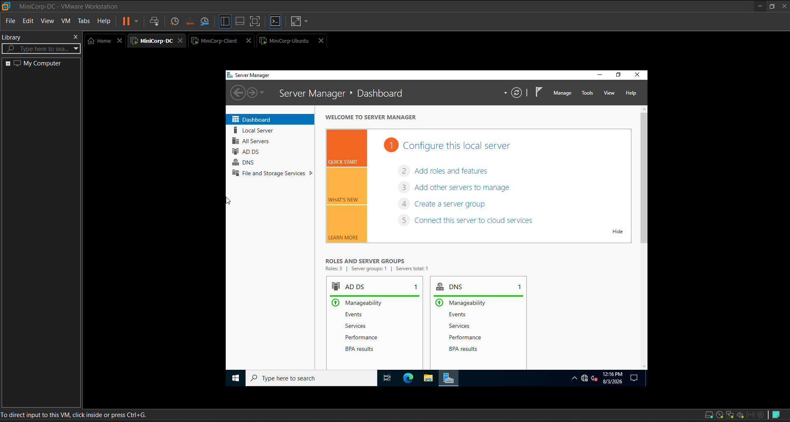
</p>

<p align="center">
<em>Figure 1. VMware Workstation hosting the complete MiniCorp enterprise environment.</em>
</p>

<p align="center">
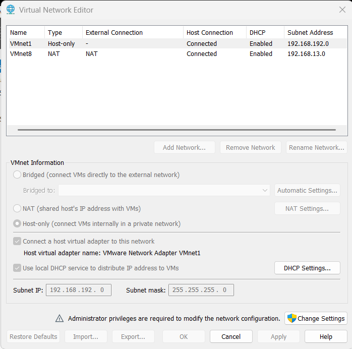
</p>

<p align="center">
<em>Figure 2. VMware Virtual Network Editor configuration for the isolated enterprise network.</em>
</p>

<p align="center">
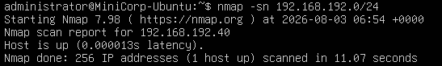
</p>

<p align="center">
<em>Figure 3. ARP-based host discovery performed against the scoped MiniCorp infrastructure.</em>
</p>

---

### Active Directory

<p align="center">
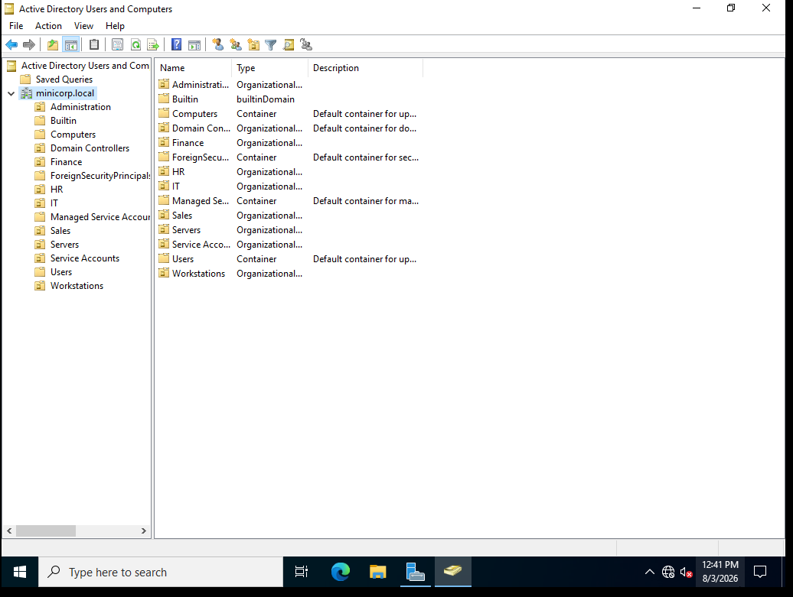
</p>

<p align="center">
<em>Figure 4. Active Directory Users and Computers showing the MiniCorp domain structure.</em>
</p>

<p align="center">
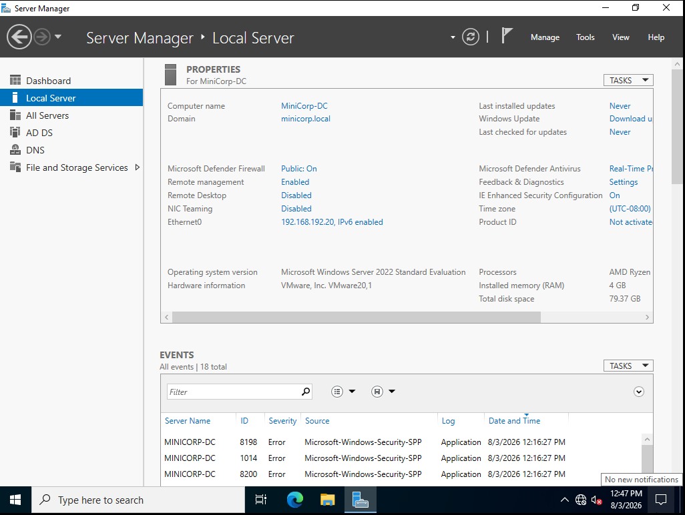
</p>

<p align="center">
<em>Figure 5. Windows Server 2022 acting as the MiniCorp Domain Controller.</em>
</p>

---

### Group Policy

<p align="center">
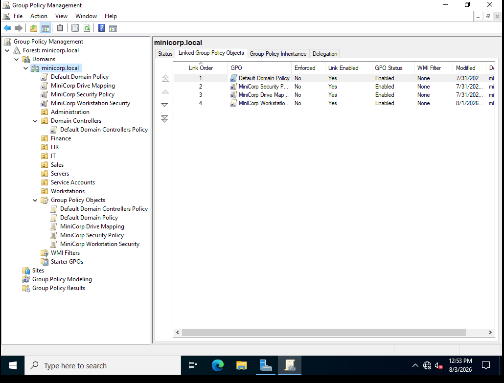
</p>

<p align="center">
<em>Figure 6. Group Policy Management Console.</em>
</p>

<p align="center">
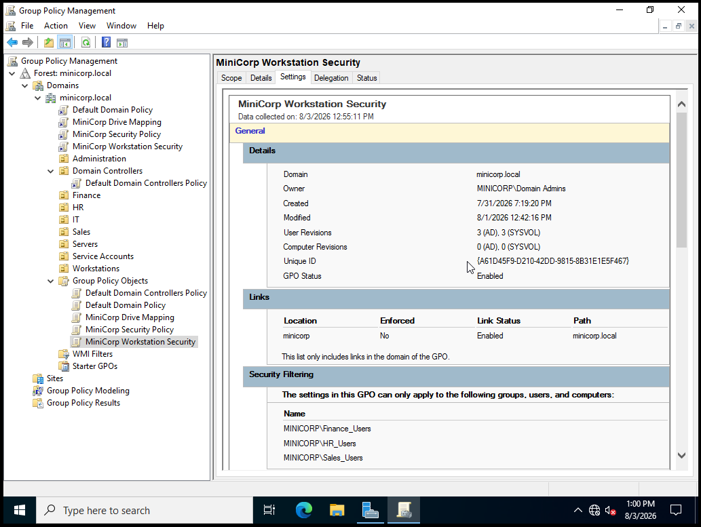
</p>

<p align="center">
<em>Figure 7. MiniCorp Workstation Security Group Policy.</em>
</p>

<p align="center">
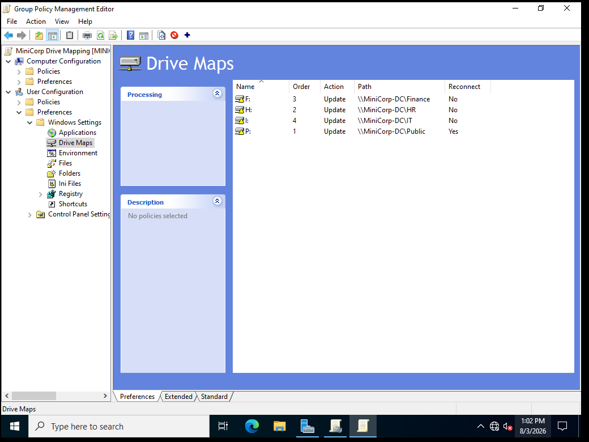
</p>

<p align="center">
<em>Figure 8. Department drive mapping configuration.</em>
</p>

<p align="center">
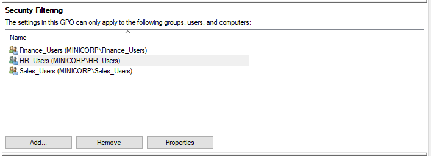
</p>

<p align="center">
<em>Figure 9. Security filtering applied to the Group Policy Object.</em>
</p>

---

## Table of Contents

- [Overview](#overview)
- [Why MiniCorp?](#why-minicorp)
- [Key Features](#key-features)
- [Enterprise Architecture](#enterprise-architecture)
- [Technology Stack](#technology-stack)
- [Infrastructure Overview](#infrastructure-overview)
- [Windows Domain Controller](#windows-domain-controller)
- [Active Directory Structure](#active-directory-structure)
- [Windows Client](#windows-client)
- [Ubuntu Server](#ubuntu-server)
- [Network Design](#network-design)
- [Active Directory Administration](#active-directory-administration)
- [Windows Administration](#windows-administration)
- [Linux Administration](#linux-administration)
- [Security Configuration](#security-configuration)
- [Assessment Methodology](#assessment-methodology)
- [Assessment Summary](#assessment-summary)
- [Key Findings](#key-findings)
- [Hardening Highlights](#hardening-highlights)
- [MITRE ATT&CK Mapping](#mitre-attck-mapping)
- [Skills Demonstrated](#skills-demonstrated)
- [Project Statistics](#project-statistics)
- [Repository Structure](#repository-structure)
- [Documentation Guide](#documentation-guide)
- [Future Improvements](#future-improvements)
- [Lessons Learned](#lessons-learned)
- [Ethics](#ethics)

---

## Overview

- MiniCorp is a simulated enterprise environment built to demonstrate practical skills in infrastructure deployment, centralized administration, and internal security assessment.

- The environment models a small corporate network consisting of:

    - Windows Server 2022 Domain Controller
    - Windows 10 domain-joined workstation
    - Ubuntu Server 24.04 LTS
    - Active Directory Domain Services
    - DNS
    - LDAP
    - SMB
    - Group Policy
    - Apache
    - PHP
    - MariaDB
    - WordPress

- Unlike projects that focus solely on exploitation or infrastructure deployment, MiniCorp demonstrates the complete enterprise lifecycle:

    - Enterprise infrastructure design
    - Windows Server deployment
    - Linux server deployment
    - Identity and access management
    - Centralized administration
    - Security assessment
    - Technical reporting
    - Security hardening recommendations

- All systems, credentials, assessment activities, screenshots, and documentation contained within this repository belong exclusively to a privately owned laboratory environment created for educational and portfolio purposes.

---

## Why MiniCorp?

- Many cybersecurity projects demonstrate individual tools or isolated attack techniques.

- MiniCorp instead demonstrates how multiple enterprise technologies integrate into a functioning environment that can be deployed, administered, assessed, documented, and hardened.

- The project combines:

    - Enterprise infrastructure
    - Active Directory administration
    - Windows administration
    - Linux administration
    - Identity and Access Management (IAM)
    - Group Policy
    - Enterprise networking
    - Internal security assessment
    - Professional documentation

- This provides practical experience that closely resembles real enterprise environments.

---

## Key Features

- Enterprise Active Directory deployment
- Windows Server 2022 administration
- Windows 10 domain integration
- Ubuntu Server deployment
- Apache HTTP Server
- PHP
- MariaDB
- WordPress
- Organizational Unit design
- Security group management
- Department-based authorization
- NTFS permissions
- SMB file sharing
- DNS
- LDAP
- Group Policy implementation
- Structured internal security assessment
- Evidence-based findings
- Hardening recommendations
- Professional technical documentation

---

## Enterprise Architecture

- The MiniCorp environment simulates a small enterprise network consisting of centralized identity management, managed Windows endpoints, and Linux-based web infrastructure.

<p align="center">

</p>

<p align="center">
<em>Figure 10. Enterprise network architecture.</em>
</p>

---

## Active Directory Structure

- The enterprise directory service is organized using Organizational Units, security groups, and departmental access controls.

<p align="center">

</p>

<p align="center">
<em>Figure 11. Active Directory hierarchy implemented within MiniCorp.</em>
</p>

---

## Authentication & Authorization Workflow

- Authentication is performed through Active Directory while authorization is enforced using security groups together with SMB and NTFS permissions.

<p align="center">
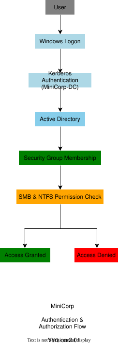
</p>

<p align="center">
<em>Figure 12. Enterprise authentication and authorization workflow.</em>
</p>

---

## Group Policy Processing

- Group Policy Objects provide centralized configuration management for domain-joined systems.

<p align="center">

</p>

<p align="center">
<em>Figure 13. Group Policy processing within the MiniCorp environment.</em>
</p>

---

## Security Assessment Workflow

- The assessment followed a structured workflow progressing from infrastructure validation through reporting and remediation.

<p align="center">
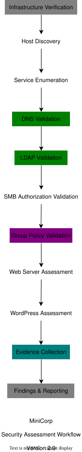
</p>

<p align="center">
<em>Figure 14. Internal security assessment workflow.</em>
</p>

---

## Technology Stack

### Infrastructure

| Category | Technology |
|-----------|------------|
| Hypervisor | VMware Workstation |
| Domain Controller | Windows Server 2022 |
| Client Workstation | Windows 10 |
| Linux Server | Ubuntu Server 24.04 LTS |

---

### Identity & Access Management

| Component | Technology |
|-----------|------------|
| Directory Service | Active Directory Domain Services |
| Domain | `minicorp.local` |
| Authentication | Kerberos |
| Directory Queries | LDAP |
| Authorization | Active Directory Security Groups |
| Access Control | NTFS Permissions & SMB Share Permissions |
| Policy Management | Group Policy |

---

### Network Services

| Service | Technology |
|----------|------------|
| DNS | Microsoft DNS |
| SMB | Microsoft SMB |
| File Sharing | Windows File Services |
| Remote Administration | OpenSSH (Ubuntu) |

---

### Web Platform

| Component | Technology |
|-----------|------------|
| Operating System | Ubuntu Server 24.04 LTS |
| Web Server | Apache HTTP Server |
| Runtime | PHP |
| Database | MariaDB |
| Content Management System | WordPress |

---

### Assessment Tools

| Tool | Purpose |
|------|---------|
| Nmap | Host discovery, service detection, and port scanning |
| Nikto | Web server assessment |
| Gobuster | Directory enumeration |
| curl | Manual HTTP inspection |
| ldapsearch | LDAP enumeration |
| smbclient | SMB validation |
| nslookup | DNS resolution testing |
| dig | DNS interrogation |

---

## Infrastructure Overview

- The MiniCorp environment consists of three primary virtual machines connected through an isolated virtual network. Each system performs a dedicated enterprise role while communicating through standard Windows and Linux services.

| System | Role | IP Address |
|---------|------|------------|
| MiniCorp-DC | Domain Controller | `192.168.192.20` |
| MiniCorp-Client | Domain-Joined Workstation | `192.168.192.30` |
| MiniCorp-Ubuntu | Linux Web Server | `192.168.192.40` |

---

## Windows Domain Controller

- The Domain Controller serves as the central management system for the enterprise environment.

- Its responsibilities include:

    - Centralized authentication
    - Centralized authorization
    - Policy enforcement
    - DNS services
    - Directory services
    - Enterprise file sharing

### Configured Services

| Service | Purpose |
|----------|---------|
| Active Directory Domain Services | Centralized identity management |
| DNS | Domain name resolution |
| LDAP | Directory access |
| Kerberos | Authentication |
| SMB | Network file sharing |
| SYSVOL | Group Policy replication |
| NETLOGON | Logon services |
| Group Policy Management | Centralized policy administration |

---

## Active Directory Structure

- The Active Directory implementation models a departmental enterprise environment.

### Organizational Units

- HR
- Finance
- IT
- Sales
- Servers
- Workstations

### Security Groups

- HR_Users
- Finance_Users
- Sales_Users
- IT_Admins
- Domain Admins
- Server_Admins
- Workstation_Admins

### Example Users

- Alice Johnson
- Bob Smith
- Charlie Brown
- David Wilson

Authorization is enforced through Active Directory group membership combined with SMB share permissions and NTFS permissions.

---

## Windows Client

- The Windows client represents a managed enterprise workstation joined to the Active Directory domain.

- The workstation is used to validate:

    - Domain authentication
    - Centralized administration
    - Group Policy enforcement
    - Department-based authorization
    - Enterprise access control

### Implemented Features

- Domain Join
- Department User Accounts
- Group Policy Processing
- Department Drive Mapping
- Registry Restrictions
- Command Prompt Restrictions
- Control Panel Restrictions

These configurations demonstrate how enterprise administrators centrally manage Windows endpoints.

---

## Ubuntu Server

- The Ubuntu Server hosts the enterprise web application assessed during the security evaluation.

### Installed Components

| Component | Purpose |
|-----------|---------|
| Ubuntu Server 24.04 LTS | Operating System |
| Apache HTTP Server | Web Server |
| PHP | Server-side Runtime |
| MariaDB | Database Server |
| WordPress | Enterprise Web Application |
| OpenSSH | Remote Administration |

---

### Network Configuration

- The server uses two network interfaces.

| Interface | Purpose |
|-----------|---------|
| Host-Only Adapter | Internal MiniCorp network communication |
| NAT Adapter | Internet connectivity for updates and package installation |

- This separation mirrors common enterprise deployment practices by isolating internal communication from external connectivity.

---

## Network Design

- MiniCorp uses an isolated host-only network to simulate internal enterprise communication.

| Network | Purpose |
|----------|---------|
| `192.168.192.0/24` | Internal enterprise network |
| NAT Network | Internet connectivity for Ubuntu updates |

- This architecture enables secure communication between enterprise systems while preventing unintended interaction with external networks.

---

## Active Directory Administration

- The project demonstrates practical enterprise administration tasks including:

    - Domain creation
    - Organizational Unit management
    - User account administration
    - Security group administration
    - Group membership management
    - Department-based authorization
    - SMB share configuration
    - NTFS permission management

- These tasks closely resemble day-to-day responsibilities performed by enterprise Windows administrators.

---

## Windows Administration

- Centralized administration is implemented through Active Directory and Group Policy.

### Implemented Policies

- Password Policy
- Account Lockout Policy
- Interactive Logon Banner
- Drive Mapping
- Registry Restrictions
- Command Prompt Restrictions
- Control Panel Restrictions
- User-based Security Filtering

These policies demonstrate centralized configuration management across domain-joined systems.

---

## Linux Administration

- The Linux administration component focuses on deploying and maintaining a production-style web server.

### Administrative Tasks

- Ubuntu Server installation
- Static IP configuration
- Apache deployment
- MariaDB installation
- WordPress deployment
- OpenSSH configuration
- Package management
- Service administration

Together, these tasks demonstrate practical Linux system administration within an enterprise environment.

---

## Security Configuration

- MiniCorp incorporates multiple enterprise security controls that demonstrate centralized identity management and layered authorization.

### Identity & Access Management

- Authentication and authorization are centralized through Active Directory Domain Services.

- Implemented controls include:

    - Centralized user authentication
    - Department-based authorization
    - Security group management
    - Organizational Unit separation
    - Role-Based Access Control (RBAC)
    - Centralized account administration

---

### Group Policy

- Group Policy provides consistent configuration across all managed Windows systems.

| Policy | Purpose |
|----------|---------|
| Password Policy | Enforce password complexity |
| Account Lockout Policy | Mitigate password guessing |
| Interactive Logon Banner | Display organizational security notice |
| Drive Mapping | Automatically map departmental network shares |
| Registry Restrictions | Prevent unauthorized registry modification |
| Command Prompt Restrictions | Restrict command interpreter access |
| Control Panel Restrictions | Restrict system configuration |
| Security Filtering | Apply policies to selected user groups |

---

### File Sharing & Authorization

- Departmental resources are protected through layered authorization using:

    - Active Directory Security Groups
    - SMB Share Permissions
    - NTFS Permissions

- This layered model ensures users receive access only to resources assigned to their departmental role.

---

## Core Enterprise Services

| Service | Purpose |
|----------|---------|
| DNS | Name resolution |
| LDAP | Directory queries |
| Kerberos | Authentication |
| SMB | Enterprise file sharing |
| Group Policy | Centralized configuration |

- These services collectively provide the identity, authentication, authorization, and administration foundation of the MiniCorp environment.

---

## Assessment Methodology

- Following infrastructure deployment, a structured internal security assessment was performed against the MiniCorp environment.

- The assessment focused on validating service configurations, verifying authorization controls, identifying exposed attack surfaces, and documenting evidence-based observations.

> **Important**
>
> All assessment activities were performed exclusively within the isolated MiniCorp laboratory environment.

---

### Assessment Scope

#### Systems Assessed

| System | Assessment Areas |
|----------|------------------|
| MiniCorp-DC | DNS, LDAP, SMB, Active Directory Services |
| MiniCorp-Client | Group Policy, Authentication, Access Control Validation |
| MiniCorp-Ubuntu | Apache, WordPress, Web Server Configuration |

---

### Assessment Objectives

- The assessment aimed to:

    - Discover enterprise hosts
    - Identify exposed network services
    - Validate Active Directory functionality
    - Verify DNS operation
    - Assess LDAP accessibility
    - Validate SMB authorization
    - Review web server configuration
    - Assess the deployed WordPress application
    - Document findings and remediation recommendations

---

## Assessment Workflow

- The assessment followed a structured workflow from infrastructure validation through reporting.

<p align="center">

</p>

---

### Assessment Tools

| Tool | Purpose |
|------|---------|
| Nmap | Host discovery and service enumeration |
| Nikto | Web server assessment |
| Gobuster | Directory enumeration |
| curl | Manual HTTP inspection |
| ldapsearch | LDAP enumeration |
| smbclient | SMB validation |
| nslookup | DNS validation |
| dig | DNS interrogation |

---

## Network Enumeration

- Infrastructure validation began by identifying active hosts and verifying enterprise services within the defined assessment scope.

### Enumerated Systems

| Host | Operating System | Role |
|------|------------------|------|
| MiniCorp-DC | Windows Server 2022 | Domain Controller |
| MiniCorp-Client | Windows 10 | Domain Workstation |
| MiniCorp-Ubuntu | Ubuntu Server 24.04 LTS | Web Server |

---

### Service Validation

- Service enumeration confirmed the expected enterprise services.

#### MiniCorp-DC

- Validated services included:

    - DNS
    - Kerberos
    - LDAP
    - SMB
    - Microsoft RPC
    - Global Catalog
    - WinRM

### MiniCorp-Ubuntu

- Validated services included:

    - SSH
    - HTTP

- No unexpected services were identified during the assessment.

---

## DNS Assessment

- DNS validation confirmed:

    - Forward lookup functionality
    - Authoritative responses
    - Internal domain resolution
    - Active Directory integrated DNS operation

- The assessment verified successful resolution of the `minicorp.local` domain.

---

## LDAP Assessment

- Authenticated LDAP enumeration successfully retrieved:

    - User objects
    - Security groups
    - Organizational Units
    - Distinguished Names
    - Naming Contexts

- This demonstrated the information available to authenticated domain users while validating correct directory service operation.

---

## SMB Assessment

- SMB testing focused on validating authorization rather than identifying misconfigurations.

- Authenticated testing confirmed that access permissions aligned with Active Directory group membership.

### Example Validation

| Share | HR User |
|---------|:------:|
| HR | ✅ |
| Public | ✅ |
| Finance | ❌ |
| IT | ❌ |

- This validated:

    - Department-based authorization
    - Active Directory Security Groups
    - SMB Share Permissions
    - NTFS Permissions

---

## Web Application Assessment

- The Ubuntu Server hosted a WordPress application running on Apache with MariaDB.

- Assessment activities included:

    - HTTP inspection
    - Directory enumeration
    - Default endpoint verification
    - Configuration review
    - Administrative interface identification

### Identified Technologies

| Component | Technology |
|------------|------------|
| Operating System | Ubuntu Server |
| Web Server | Apache HTTP Server |
| Runtime | PHP |
| Database | MariaDB |
| CMS | WordPress |

---

### Assessment Summary

| Assessment Area | Status |
|-----------------|:------:|
| Network Enumeration | ✅ |
| Service Identification | ✅ |
| DNS Validation | ✅ |
| LDAP Validation | ✅ |
| SMB Authorization Validation | ✅ |
| Group Policy Validation | ✅ |
| Web Server Assessment | ✅ |
| WordPress Assessment | ✅ |
| Configuration Review | ✅ |
| Evidence Collection | ✅ |

- The assessment demonstrated that the MiniCorp environment functioned as intended while providing realistic opportunities to validate enterprise administration and security controls.

---

## Key Findings

| ID | Finding | Severity | Status |
|----|----------|:--------:|:------:|
| MC-001 | Apache `server-status` endpoint accessible | Low | Documented |
| MC-002 | WordPress administrative interface exposed | Informational | Documented |
| MC-003 | WordPress XML-RPC endpoint available | Informational | Documented |
| MC-004 | Departmental SMB authorization functioning correctly | Positive | Validated |
| MC-005 | Active Directory integrated DNS functioning correctly | Positive | Validated |
| MC-006 | Authenticated LDAP directory enumeration available | Informational | Documented |

> Complete finding details, supporting screenshots, impact analysis, and remediation guidance are available in **`docs/08-findings.md`**.

---

## Hardening Highlights

### Windows Infrastructure

- Apply the Principle of Least Privilege.
- Review privileged group memberships regularly.
- Audit delegated permissions.
- Enable advanced auditing.
- Monitor privileged account activity.

---

### Group Policy

- Review GPOs periodically.
- Validate security filtering.
- Remove obsolete policies.
- Test policy changes before deployment.

---

### SMB

- Audit share permissions regularly.
- Review NTFS permissions.
- Remove unnecessary shares.
- Enable SMB signing where appropriate.

---

### Linux Server

- Restrict access to Apache administrative endpoints.
- Keep packages updated.
- Monitor Apache logs.
- Restrict SSH access to authorized administrators.

---

### WordPress

- Enable automatic updates.
- Remove unused plugins and themes.
- Enforce strong administrator passwords.
- Enable Multi-Factor Authentication where appropriate.
- Disable XML-RPC if not required.

Detailed hardening recommendations are available in **`docs/09-hardening-recommendations.md`**.

---

## MITRE ATT&CK Mapping

| Assessment Activity | ATT&CK Technique |
|---------------------|------------------|
| Network Service Discovery | T1046 |
| System Network Configuration Discovery | T1016 |
| Remote System Discovery | T1018 |
| Account Discovery | T1087 |
| File and Directory Discovery | T1083 |
| Network Share Discovery | T1135 |
| Active Scanning | T1595 |

> This mapping relates assessment activities to the MITRE ATT&CK framework and does not represent adversary emulation.

---

## Skills Demonstrated

| Domain | Skills |
|----------|---------|
| Enterprise Infrastructure | VMware Workstation, Windows Server 2022, Windows 10, Ubuntu Server |
| Windows Administration | Active Directory, ADUC, Organizational Units, Security Groups |
| Identity & Access Management | Kerberos, LDAP, Group Membership, Role-Based Access Control |
| Group Policy | Password Policy, Account Lockout, Drive Mapping, User Restrictions |
| File Services | SMB, NTFS Permissions, Departmental Shares |
| Linux Administration | Apache, PHP, MariaDB, WordPress, OpenSSH |
| Networking | DNS, LDAP, SMB, TCP/IP, HTTP |
| Security Assessment | Enumeration, Configuration Review, Authorization Validation |
| Documentation | Technical Writing, Findings, Hardening Recommendations |

---

## Project Statistics

| Metric | Value |
|---------|------:|
| Virtual Machines | 3 |
| Operating Systems | 3 |
| Active Directory Domain | 1 |
| Organizational Units | 6 |
| Security Groups | 7+ |
| Department Users | 4 |
| SMB Shares | Multiple |
| Core Infrastructure Services | 5 |
| Assessment Tools Used | 8 |
| Assessment Areas | 9 |
| Findings Documented | 6 |

---

## Repository Structure

```text
MiniCorp/
│
├── README.md
├── .gitignore
│
├── diagrams/
│   ├── README.md
│   ├── enterprise-network.svg
│   ├── active-directory.svg
│   ├── authentication-flow.svg
│   ├── group-policy-flow.svg
│   └── security-assessment-workflow.svg
│
├── docs/
│   ├── 01-project-overview.md
│   ├── 02-lab-architecture.md
│   ├── 03-active-directory.md
│   ├── 04-linux-server.md
│   ├── 05-network-services.md
│   ├── 06-group-policy.md
│   ├── 07-security-assessment.md
│   ├── 08-findings.md
│   ├── 09-hardening-recommendations.md
│   ├── 10-mitre-attack-mapping.md
│   └── 11-lessons-learned.md
│
├── reports/
│   ├── executive-summary.md
│   └── security-assessment-report.md
│
└── screenshots/
   ├── infrastructure/
   │   ├── vmware-workstation.png
   │   ├── virtual-network-editor.png
   │   └── host-discovery.png
   │
   ├── active-directory/
   │   ├── active-directory-users-and-computers.png
   │   └── domain-controller.png
   │
   ├── group-policy/
   │   ├── group-policy-management.png
   │   ├── workstation-security-gpo.png
   │   ├── drive-mapping-gpo.png
   │   └── security-filtering.png
   │
   ├── linux/
   │   ├── ubuntu-server.png
   │   ├── apache-service-running.png
   │   ├── mariadb-service-running.png
   │   └── network-configuration.png
   │
   ├── wordpress/
   │   ├── wordpress-login.png
   │   ├── wordpress-dashboard.png
   │   └── xmlrpc-endpoint.png
   │
   └── assessment/
       ├── ldap-enumeration.png
       ├── dns-validation.png
       ├── smb-validation.png
       └── apache-server-status.png

```

---

## Documentation Guide

| Document | Description |
|----------|-------------|
| `01-project-overview.md` | Project goals, scope, and learning objectives |
| `02-lab-architecture.md` | Enterprise architecture and network design |
| `03-active-directory.md` | Active Directory implementation |
| `04-linux-server.md` | Ubuntu Server deployment and web stack |
| `05-network-services.md` | DNS, LDAP, SMB, and supporting services |
| `06-group-policy.md` | Group Policy implementation |
| `07-security-assessment.md` | Assessment methodology and execution |
| `08-findings.md` | Detailed findings, evidence, and remediation |
| `09-hardening-recommendations.md` | Security improvement recommendations |
| `10-mitre-attack-mapping.md` | MITRE ATT&CK mapping |
| `11-lessons-learned.md` | Key project takeaways |

---

## Future Improvements

- Potential future enhancements include:

    - Windows Event Forwarding (WEF)
    - Sysmon deployment
    - Microsoft Defender integration
    - Wazuh deployment
    - SIEM log collection
    - Additional Linux servers
    - Active Directory Certificate Services (AD CS)
    - Internal Public Key Infrastructure (PKI)
    - IIS deployment
    - Automated compliance auditing
    - Infrastructure-as-Code deployment

- These enhancements are intentionally listed as future work and are **not** part of the current implementation.

---

## Lessons Learned

- Building MiniCorp reinforced the importance of integrating infrastructure deployment, centralized administration, and structured security assessment into a single workflow.

- The project provided practical experience with:

    - Enterprise infrastructure deployment
    - Active Directory administration
    - Windows administration
    - Linux server deployment
    - Enterprise networking
    - Identity and Access Management (IAM)
    - Security assessment methodology
    - Technical documentation
    - Security reporting
    - Hardening recommendations

- Perhaps the most valuable lesson was understanding that effective security assessments depend not only on technical validation, but also on accurate documentation, reproducible evidence, and well-supported conclusions.

---

## Ethics

- This project was designed, deployed, administered, and assessed exclusively within a privately owned laboratory environment.

- No third-party infrastructure, organizations, or individuals were targeted during the creation of this repository.

- The techniques documented throughout this project are intended solely for:

    - Authorized security assessments
    - Enterprise administration training
    - Defensive security validation
    - Cybersecurity education
    - Research within controlled environments

- Always obtain explicit authorization before assessing systems you do not own or administer.

---

<div align="center">

## MiniCorp

### Enterprise Infrastructure, Active Directory Administration, and Security Assessment Lab

Designed, deployed, administered, assessed, and documented as a complete enterprise cybersecurity portfolio project.

---

⭐ If you found this project useful or interesting, consider starring the repository.

</div>
